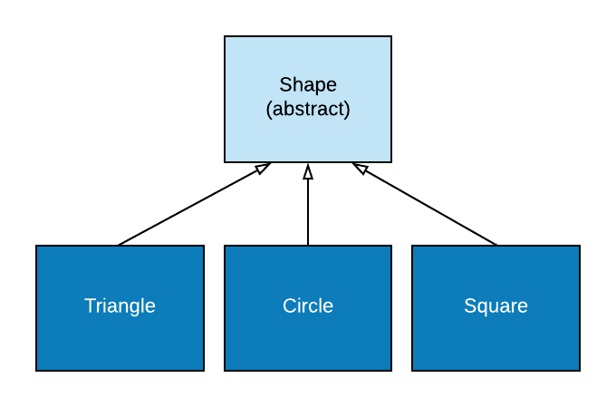
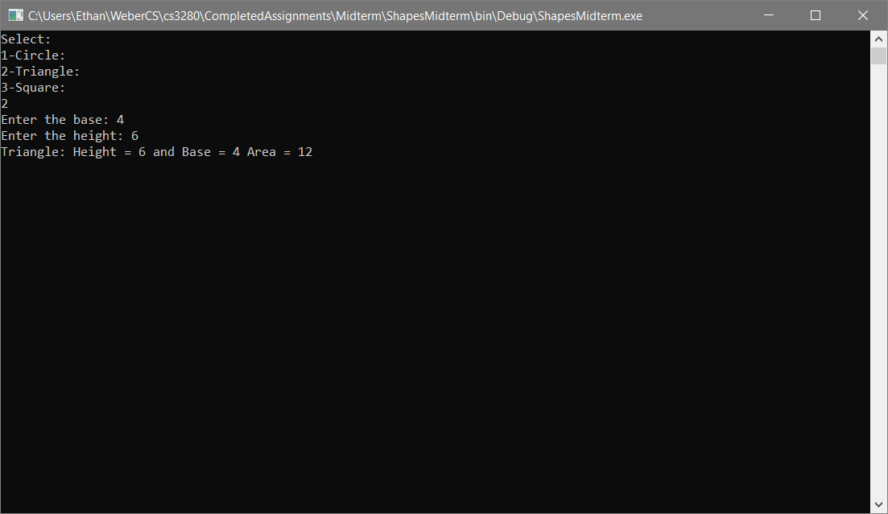
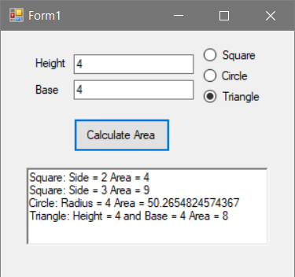

# Midterm Instructions #

## Included Files ##

1. ShapesMidterm project
    * `Shape.cs` - an abstract class
    * `Program.cs` - A small console application
2. ShapesFormApp project
   * `ShapesWindow.cs` - A GUI window that is incomplete
3. ShapesMidtermTests project
   * `CircleTests.cs` - provided unit tests for `Circle` class
   * `SquareTests.cs` - provided unit tests for `Square` class
   * `TriangleTests.cs` - provided unit tests for `Triange` class

## Part 1: Inheritance/Polymorphism ##

You are to demonstrate your understanding of inheritance and polymorphism by completing the following tasks:



1. Create new classes for 3 shapes that inherit from the given `Shape` class
   1. `Triangle`
   2. `Circle`
   3. `Square`
2. Add appropriate properties to each shape (Side for Square, Radius for Circle, Base and Height for Triangle)
3. override the `Area` property to return the proper area for the shape  (`System.Math` will be important here)
   1. Triangle Area Formulat - 1/2 * b * h
   2. Circle Area Formula - pi * r^2
   3. Square Area Formula - side^2
4. override the `ToString()` methods on each to return a string that matches this format:

```[output]
Square: Side = 2
Triangle: Height = 2 and Base = 3
Circle: Radius = 16.23495812  // don't worry about truncating this, just print it
```

When the above tasks are completed you should test your code with the included unit test project.
You must be passing all 6 tests to get full credit on this part.

You can also test your class's code by running the console program that is included. Here is an example output from it.



>Make a commit with the message *"Part 1 Complete"* when you finish this part.

## Part 2: Windows Forms ##

Once you have the completed the first part of the test you will need to modify the code behind the `ShapesWindow`.
`ShapesWindow` gui is already laid out with all of the elements it needs. You just need to complete the `AreaButton_Click` method.

Here are the requirements and some hints to help you:

1. **Use polymorphism to cut down on repeated code**
2. Get the parameter(s) for the shape from the parameter `TextBox`(s)
3. The tricky shape will be `Triangle` because it requires a second parameter. `param2Textbox` is how you will get that second parameter
4. You must validate all input. Use the included `InvalidInput()` method to give user feedback
5. Once you have the shape instantiated print its `ToString()` method with ` Area = ` ***area*** to the `outputBox`. Use string interpolation.

>Make a commit with the message: *"Part 2 Complete"* when you finish this part.

Example Output:



You can see that each time you click `Calculate Area` it will display the shape information and area on a new line.

## Submitting ##

Once you have completed the requirements and have made the proper commits, submit the url to your private github repository on canvas.

If you run out of time and have not finished make a **commit** with the message *"Incomplete"* and submit the url on canvas.

## Grading ##

Part 1:

| Requirement | Points Possible |
| ----------- | --------------- |
| 3 Shape classes inherit from Shape and are implemented properly | |
| ToString() methods are formatted correctly and use string interpolation | |
| Area Property returns the correct area for the shape as a `double` | |

Part 2:

| Requirement | Points Possible |
| ----------- | --------------- |
| No repeated code for the 3 shapes | |
| Output to outputBox is correctly formatted | |
| All input is validated (no exception are able to crash the app) | |
